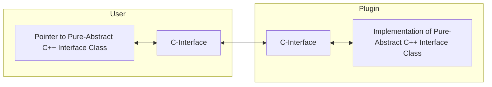

# Brief

A simple demonstration of a C++ Plugin-System for Windows using a pure-virtual Interface instanciated via C-Interface for better ABI compatibility and to avoid name-mangling.

# Reference

This small sample project is based on [this](https://cplusplus.com/articles/48TbqMoL/) article.
