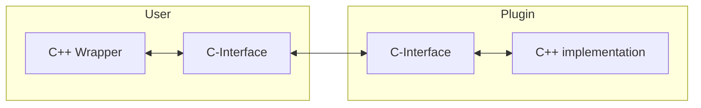

# Brief

A simple demonstration of a C++ Plugin-System for Windows using a C-Interface for better ABI compatibility and to avoid name-mangling. 

# Motivation

You can find a good article about the basics of plugin systems [here](https://cplusplus.com/articles/48TbqMoL/). While the article does briefly talk about how one can improve ABI compatibility and avoid name-mangling by using a C-interface, the provided example does not include a C-interface. Futhermore, there are no details on how one might provide access to C++-Code through a C-Interface. I have tried to achieve both in this small project.
