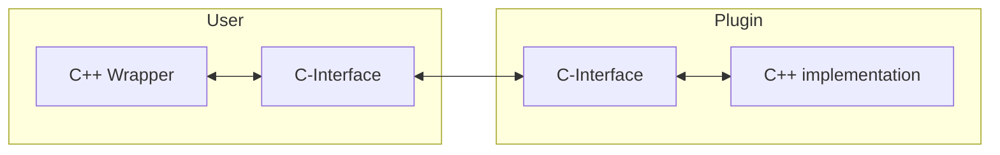

# Description

A simple demonstration of a C++ Plugin-System for Windows using a C-Interface for better ABI and to avoid name-mangling. 

```mermaid
graph LR
  subgraph User
    direction LR
    A[C++ Wrapper]<-->B[C-Interface]
  end
  subgraph Plugin
    direction LR
    C[C-Interface]<-->D[C++ implementation]
  end
  B <--> C
```

